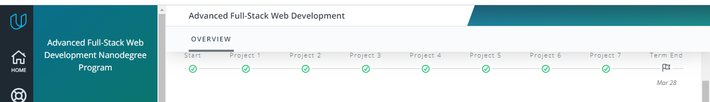
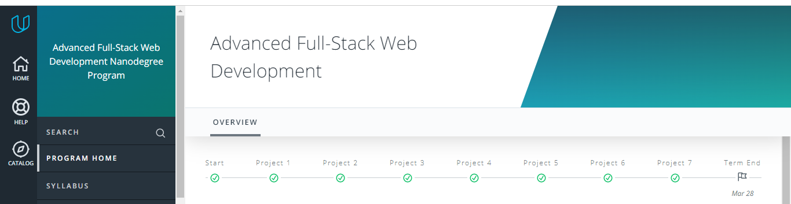

## Week  15

> FE Task

- apply shown css for title and green section with gradient color for these cases :

> Problem Solving Task
<https://codeforces.com/problemset/problem/71/A>

> Proxy Pattern Task

- Problem :  we have an ATM Machine inside a bank , it have state of cash Money on it and we have bank officer that need to check Machine state without Moving from his office to the ATM
- Required :
    implement Proxy object that can get State from ATM machine and control access to atm by bank officer

## Week  16

> FE Task

- return to FE task of **Week 15** and apply smooth transition between task cases

> Problem Solving Task
<https://codeforces.com/problemset/problem/231/A>

> Gulp Task

- produce this repo with Gulp and test it locally
<https://github.com/ElzeroWebSchool/HTML_And_CSS_Template_Three>

## Week  17

> FE Task

- card with transparent image
- make css component for card + image
- make sure to make image style reusable with any card and html element
details : <https://elzero.org/frontend-card-with-transparent-img/>

> Problem Solving Task
<https://codeforces.com/problemset/problem/158/A>

> Webpack task

- init webpack rebo and make sure bundlers for (html , css , sass , fonts , images )

## Week  18

> FE Task

- Pesudo Element Task
<https://elzero.org/frontend-creative-titles/>

> Problem Solving Task
<https://codeforces.com/problemset/problem/50/A>

> Webpack task

- init same previous repo but for ts

## Week 19

> FE Task 

- gaming-profile-sections
<https://elzero.org/frontend-gaming-profile-sections/>

> Problem Solving Task
<https://codeforces.com/problemset/problem/282/A>

> React task

- init Products Managment Template Repo

for more changllenges :
> FE :

- <https://css-challenges.com/>#
- <https://www.frontendmentor.io/solutions>
- <https://css-tricks.com/front-end-challenges/>
- https://elzero.org/category/challenges/front-end-challenges/
> Problem Solving

- https://codeforces.com/problemset/problem

# Important Links 
- Plan schedule : 
    https://docs.google.com/spreadsheets/d/138-2kwHn2DfE8MEm8DEvL-oJyEmcRAHMer2h7EGsRcU/edit#gid=0

